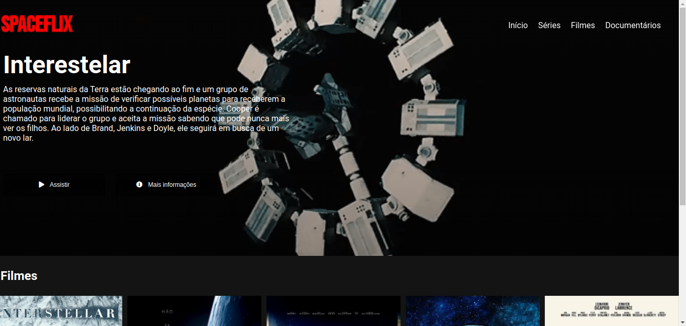

# Recriando a Interface da Netflix

### Descrição do Desafio

Recrie a interface do principal site de streaming mundial utilizando tecnologias simples como HTML5, CSS3 e JavaScript. Nesse projeto você aprenderá: como estruturar um layout, técnicas de CSS3 com containers e variáveis, como posicionar os elementos com Flexbox e como utilizar plugins JQuery a favor da sua aplicação

